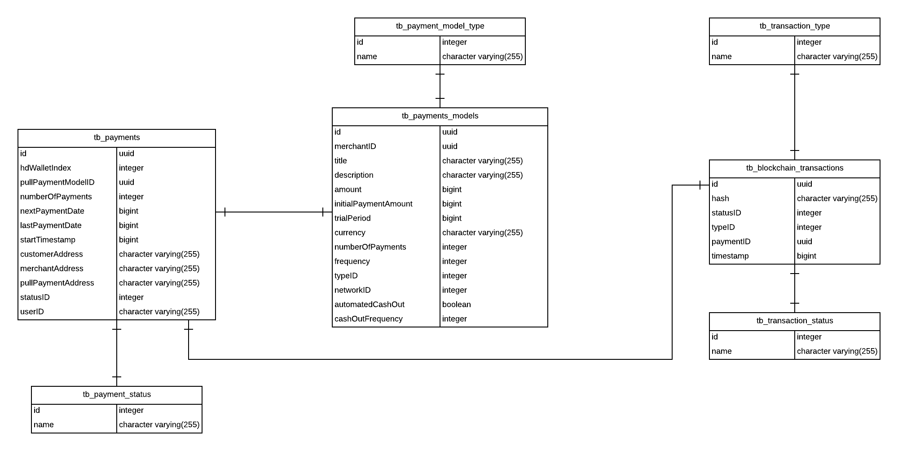

# PumaPay Pull Payment Protocol Wiki
The PumaPay Pull Payment protocol allows recurring payment to occur over the Ethereum Blockchain.

## Table of content
- [Ecosystem Components](#ecosystem-components)
    - [PumaPay Core](#pumapay-core)
    - [PumaPay SDK](#pumapay-sdk)
    - [PumaPay Merchant Backend](#pumapay-merchant-backend)
    - [PumaPay Wallet](#pumapay-wallet)
    - [PumaPay Faucet](#pumapay-faucet)
- [Blockchain Components](#blockchain-components)
    - [PumaPay Token](#pumapay-token)
    - [PumaPay Pull Payment](#pumapay-pull-payment)
- [PumaPay Core](#pumapay-core)
- [Merchant Backend](#merchant-backend)
    - [NodeJS](#nodejs)
    - [PostgreSQL Database](#postgresql-database)
    - [MySQL Database](#mysql-database)
    - [Redis](#redis)
    - [HD Wallet](#hd-wallet)
    - [Funding ETH](#funding-eth)
    - [Cashing out ETH and PMA](#cashing-out-eth-and-pma)
- [Pull Payments in detail](#pull-payment-in-detail)
    - [Pull Payment Models](#pull-payment-models)
    - [Pull Payments](#pull-payments)
    - [Pull Payments registration flow](#pull-payments-registration-flow)
- [Merchant Integration Guide](#merchant-integration-guide)
    - [Register with PumaPay as trusted merchant](#register-with-pumapay-as-trusted-merchant)
    - [Setting up NodeJS Server](#setting-up-nodejs-server)
    - [Setting up PostgreSQL Database](#setting-up-postgresql-database)
    - [Setting up MySQL Database](#setting-up-mysql-database)


## Ecosystem Components
### PumaPay Core
The core is our custom framework and heart of our system.
Our PumaPay Core allows the governance, control and utilisation of our pull payment protocol.
### PumaPay SDK
The SDK module gives functionality to any third party integrator to allow execution of pull payments as well as other utility methods.
### PumaPay Merchant Backend
The Merchant backend consists of a set of APIs that the merchant can use to connect to the rest of the
PumaPay ecosystem. It also allows the merchant to have an overview of payment models and payments.
### PumaPay Wallet
Wallet allows users who possess PMA to make pull payments with merchants that have registered and are using the
PumaPay pull payment protocol.
### PumaPay Faucet
The faucet is a component that provides test PMA tokens to development users, so that they can test their pull payments
after they have integrated with the PumaPay ecosystem. It essentially drip feeds the tokens to users so that
they have a source of tokens for testing purposes. These test tokens enable testnet users to play with and test the execution
of their pull payment models on the testnet.
You can find the PMA faucet [here](https://faucet.pumapay.io/).

## Blockchain Components
### PumaPay Token
The [PumaPay token](https://github.com/pumapayio/pumapay-token/blob/master/contracts/PumaPayToken.sol) is based on
the [ERC-20 Token standard](https://github.com/ethereum/EIPs/blob/master/EIPS/eip-20.md) developed in Solidity
and deployed on the Ethereum network on our TGE which occurred on May 7th 2018.
### PumaPay Pull Payment
The PumaPay Pull Payment Protocol supports an advanced "pull" mechanism, which allows users to not only push
tokens from one wallet to another but to also pull funds from other wallets after prior authorization has been given.

Our Pull Payment Protocol currently supports a variety of pull payment models such as:
* Single Pull Payment
* Recurring Pull Payment (Fixed amount)
* Recurring Pull Payment with initial payment
* Recurring Pull Payment with trial period
* Recurring Pull Payment with initial payment and trial period

The first version of our protocol has a semi-decentralized approach in order to reduce the gas fees that are
involved with setting the PMA/Fiat rates on the blockchain and eliminate the customer costs for registering and
cancelling pull payments, which are currently taken care of by PumaPay through the smart contract.

You can find detailed description of the smart contracts utilizing the pull payment protocol [here](https://github.com/pumapayio/pumapay-token/).

## PumaPay Core
The PumaPay Core is our custom framework and heart of our system, which allows the governance, control and utilisation of our pull payment protocol.
It consists of a set of APIs that allow for the communication between the PumaPay ecosystem components to put the pull payment protocol into action.
Currently few APIs are publicly available that allow the merchant to register with and retrieve their merchant ID and their API key that will be used
for secure communication with our core server.

[PumaPay Core API Documentation](https://stgcore.pumapay.io/core/api/v2/doc/api/#)

## Merchant Backend
The v2.0 of the PumaPay pull payment protocol on the merchant side consists of a set of APIs that the merchant
can use to connect to the rest of the PumaPay ecosystem.
All the relevant functionality is provided by the PumaPay [merchant SDK](https://github.com/pumapayio/merchant.sdk).

### NodeJS
The NodeJS server uses the merchant SDK as a singleton and provides a list of API methods that are used to write their own
pull payment models, to register the pull payments of their customers as well as executing and to monitor the
blockchain transactions related with the pull payments.

### PostgreSQL Database
The PostgreSQL database stores the pull payment models, the pull payments and the Ethereum transactions.



### MySQL Database
MySQL database is an encrypted database used for encrypting the HD wallet with the Ethereum addresses that the merchant uses on their end
for executing pull payments on the blockchain, for funding the executor addresses with ETH to pay for gas and cashing
out PMA and ETH to a bank account on their end.
<!--DB model to be provided-->

### Redis
Redis in-memory data structure store is used for storing information related to the executor address that will be
the executor of the pull payment and for storing the maximum gas used for a pull payment transaction.

### HD wallet
<!-- Explain what an HD-Wallet is - provide links as well -->
The merchant backend needs to execute pull payments on the Ethereum network. Each payment has a different executor address (merchant address that is allowed to execute a pull payment) since having only one address executing all the pull payments will be very slow if the number of customer and pull payments is high.
For that same reason, the current version of our protocol does not support multiple pull payments for the same customer address and the same merchant address. Hence we decided to use an HD-Wallet which has unlimited addresses and use a different address for each pull payment.

We made a distinction between the address at index 0 (bank account from now on) of the HD-Wallet and the rest of the addresses (executor accounts from now on) in such a way that the bank account will hold most of the ETH and PMA of the HD-Wallet. The ETH from the bank account will be used for funding the executor accounts with enough ETH to pay for the gas fees throughout the whole lifecycle of the pull payment and the PMA will be cashed-out from the executor accounts to the bank account based on the pull payment definition.

### Funding ETH
Each executor account needs to hold enough ETH to pay for the Ethereum transaction fees (gas) when executing a pull payment. For this reason, whenever a new pull payment is registered on the blockchain the relevant amount of ETH is transferred from the bank account to the executor account.
<!-- Algorithm to be provided -->

### Cashing out ETH and PMA
The idea behind funding and cashing out is to keep the most of the funds of the HD-Wallet to one address i.e. bank account. For this reason, we have implemented the cash-out functionality of ETH and PMA from the executor accounts to the bank account.
The cash-out will take place based on the definition of the pull payment model and more specifically to `automatedCashOut` which needs to be set to `true` and the `cashOutFrequency` which should be a number at least 1 if the `automatedCashOut == true`.
For example, if `automatedCashOut == true && cashOutFrequency == 1`, it implies that there should be an automated transfer of PMA from the executor account to the bank account after every execution. When the pull payment is finished i.e. all the executions took place, all the PMA and ETH left in the executor account will be transferred to the bank account. The transfer of all the funds of the executor account happens also on pull payment cancellation.

## Pull Payments in detail
An example of the available APIs that the merchants will have in their disposal after setting up their backend server can be found [here](https://stgmbackend.pumapay.io/merchant/api/v2/doc/api/#/)

#### Pull Payment Models
A merchant can create and manage their payment models within their system. That can be done through the API methods that the merchants have in their backend system.
#### Pull Payments
Pull Payments are actual payments or subscriptions that the customer has registered to. Each payment is related with a pull payment model that the merchant has defined.

### Pull Payments registration flow
A customer can subscribe with a merchant through the following flow:
1. The merchant needs to create a [pull payment model](https://stgmbackend.pumapay.io/merchant/api/v2/doc/api/#model-PullPaymentModel) through the API methods that the
merchants have in their backend system.
2. The payload for the QR code related with a payment model can be generated through the SDK and can be provided to the customer for scanning it with the PumaPay wallet - relevant API method [here](https://stgmbackend.pumapay.io/merchant/api/v2/doc/api/#operations-tag-QR_Payload).
3. By scanning the QR code from the wallet, the customer will be able to see all the details for that payment as defined in the [pull payment](https://stgmbackend.pumapay.io/merchant/api/v2/doc/api/#model-PullPayment).
4. If the customer agrees to subscribe the the pull payment, a new pull payment will be created in the merchant backend linked to the pull payment model.
5. The wallet signs the registration of the pull payment and send it to the PumaPay core for transmitting the transaction to the blockchain.
6. Once the core retrieves the transaction hash, it updates the merchant backend which after it retrieves the transaction hash, it monitors until it retrieves the transaction receipt.
7. If the transaction receipt is a successful one, funding of the executor account takes place and a scheduler is in place to execute the pull payments based on the start time and the frequency of the pull payment.
8. After all the executions are done the cash-out of ETH and PMA from the executor account to the bank account will take place. Also, any PMA cash-out as defined on the pull payment model will have taken place already.

## Merchant Integration Guide
#### Register with PumaPay as trusted merchant
The first thing that the merchant needs to do is to register through the PumaPay core APIs with the API call, possibly through Postman, in order to retrieve their
`API key` and their `merchantID` that is essential for setting up their NodeJS server.

1.	A merchant should register through our core api `/api/v2/user/register`  by providing all the relevant details as specified in
the API documentation. In the registration response, the merchant will get their `merchantID` that will be used for setting up the Node server.
It is important to make note of the `merchantID`. The merchant will also receive an email with a verification link that is used to verify the email address.

*Please note, that specified password must have at least 1 uppercase letter, at least 1 lowercase, at least 1 number and at least 1 special character.*

2.	After the email verification, the merchant should login to the core `/api/v2/login/user` by using the email and password. The login return the merchant's `pma-user-token` that should be used to access the `API key`.

3.	 The `pma-user-token` needs to be added to the header of the `API key` request `api/v2/generate-api-key`.
The response gives the `pma-api-key` that is used to communicate to the core server from the backend server.

**Important:** The `API key` and the `merchantID` **should be noted down** since they will be used later for
setting up the Merchant NodeJS server.


#### Setting up NodeJS Server
For setting up the NodeJS server, PumaPay has a docker image of the merchant backend that can be used for easy and
fast setup by the merchants.
1. Retrieve Merchant Backend Docker image
The docker image is currently in our private docker registry and verified merchants will be granted access.
Once registered you can request access by sending an email to developers@pumapay.io that includes your merchant ID, and your docker hub username/email.

Once granted access to the docker registry you can login and pull the docker image from there.

```
docker login
# use your credentials
docker-compose pull
```

Once you get the docker image you should modify the docker-compose example file that can be found in
our [here](resources).

2. Docker configuration
```
- NODE_ENV=development                          # development for testnet / production for mainnet
- HOST=localhost                                # server host
- PORT=3000                                     # server port
- CORE_API_URL=https://stgcore.pumapay.io/core  # PumaPay core URL
- MERCHANT_URL=http://localhost:3000            # Merchant server URL
- PGHOST=postgres_merchant                      # PostgreSQL db host
- PGUSER=db_user                                # PostgreSQL db user
- PGPASSWORD=db_pass                            # PostgreSQL db password
- PGDATABASE=db_name                            # PostgreSQL db name
- PGPORT=5432                                   # PostgreSQL db port
- REDIS_PORT=6379                               # Redis Port
- REDIS_HOST=merchant_redis                     # Redis Host
- REDIS_TOKEN=123456789                         # Redis token - AWS Setup
- ETH_NETWORK=3                                 # Ethereum network - 3 for testnet / 1 for mainnet
- KEY_DB_HOST=db_host                           # MySQL db host
- KEY_DB_USER=db_user                           # MySQL db user
- KEY_DB_PASS=db_pass                           # MySQL db password
- KEY_DB=db_name                                # MySQL db name
- KEY_DB_PORT=3306                              # MySQL db port
- MNEMONIC_ID=mnemonic_phrase_id                # Mnemonic phrase ID - as stored in MySQL db from the SQL script
- BALANCE_MONITOR_INTERVAL=21600000             # Time interval in seconds to monitor the balance of the bank wallet account
- BALANCE_CHECK_THRESHOLD=0.1                   # Threshold which will send an email notifcation to the email provided
- SENDGRID_API_KEY=RETRIEVE_ONE_FROM_SENDGRID   # SendGrid API key - is used for sending emails related with wallet balances
- BALANCE_CHECK_EMAIL=test@test.test            # Receiver email for the balance checker - testing environment
- BALANCE_CHECK_EMAIL_PROD=test@test.test       # Receiver email for the balance checker - production environment
- CORE_API_KEY=API_KEY_RETRIEVED_FROM_CORE      # API key retrieved after registering to PumaPay core server
- MERCHANT_ID=MERCHANT_ID_RETRIEVED_FROM_CORE   # Merchant ID as retrieved from PumaPay core after registration
```

#### Setting up PostgreSQL Database
Install the PostgreSQL Database, preferably on the separate server, and make sure you have the secure connection to the server running the Node project. Create a user and a database, and add credentials to the docker-compose enviroment variables (`PGHOST, PGUSER, PGPASSWORD, PGDATABASE, PGPORT`).

Grant all privilages to the created user over the database that is going to be used by the backend.

All the PostgreSQL DB scripts for setting up the PostgreSQL database can be found [here](https://github.com/pumapayio/server-config-merchant/tree/master/resources/db).

Before runing the script  make sure  to edit each script and set the correct `PGUSER`. For example:
```
The SQL scripts can run as provided but it is highly recommended that database user is changed according to the
PostgeSQL database that the merchant has setup.
Example:
```sql
ALTER TABLE public.tb_payment_status
    OWNER to local_user;
```
should become
```
ALTER TABLE public.tb_payment_status
    OWNER to your_username;
```

Than the scripts can be ran one by one or merged into a single script using the tools like Gulp.

After successfully runing the scripts, you should have the database ready.

#### Setting up MySQL Database

It is recommended not to use the root user.  Before initializing the database, please create a user and add the username to the `KEY_DB_USER` variable in the docker-compose file.
After adding the user, create a database, name as you like, and add the database name to the `KEY_DB` variable in the docker-compose file.
Make sure to grant all the privileges to the new user over the created database.

Preferably mysql instance will run on separate server, that talks to the Node server over secure connection.
Connection details of the mysql connection should be included in the docker-compose file (`KEY_DB_HOST, KEY_DB_USER, KEY_DB_PASS, KEY_DB_PORT, KEY_DB`)

Make sure that the mysql version supports `keyring_file.so` and `keyring_udf.so` plugin as it is used to encrypt the data.

After you created the user and the databse, you can run initialization scripts that can be found [here](https://github.com/pumapayio/server-config-merchant/tree/master/resources/account-db).
Before starting the intialization make sure to replace all occurences of the example user name (`db_service`) with the username you created and used to create the database.
You need to change this in all the scripts. After this is done, you can run initialization scripts.

The initialization should be done in the following order.
* First add stored procedures from [here](https://github.com/pumapayio/server-config-merchant/tree/master/resources/account-db/stored-procedures).

* Populate  database by running the scripts from [here](https://github.com/pumapayio/server-config-merchant/tree/master/resources/account-db/init)

In order to add the account data the merchant needs to edit  the `/account-db/init/add_data.sql` script and addits own mnemonic and account details. This information is going to be encrypted in the database, so it is recomended that after the server has started you delete the content of these files.

All the MySQL DB scripts for setting up the MySQL database can be found [here](https://github.com/pumapayio/server-config-merchant/tree/master/resources/account-db).
The merchant will need to add their encryption key to the configuration files inside the `init` folder, by executing the following SQL script:
```sql
call add_table_keys('ENCRYPTION_KEY_DEFINED_BY_MERCHANT');
```
In addition the merchants need to add their mnemonic phrase of their HD wallet.
Note that the mnemonicID should be the same as specified in the docker compose file, and represented in a form of a string.
```sql
CALL add_mnemonic('mnemonic_phrase_id', 'merchants hd wallet generated twelve word mnemonic phrase should be placed here', 'ENCRYPTION_KEY_DEFINED_BY_MERCHANT');
```

#### Setting up the Redis instance
Merchant backend needs to connect to a Redis instance through the host and port provided in the docker-compose file  (`REDIS_PORT` and `REDIS_HOST`).
The instance can be either created on the same server as the Node server, or on a different server instance.
Recommended approach is to have all the different tiers running on a separate servers, which means ideally Redis would start on a server that is opened to the server on which the
Node project is running.

#### Start docker containers
Once the merchant backend system and all configurations are in place you can start the nodeJS server, which will start and automatically download all of the missing dependencies
```
# Start the node js server
docker-compose up -d
# Check the logs of the running containers
docker-compose logs -f
# Stop and remove the running containers
docker-compose down
```
More commands for docker and docker-compose can be found [here](https://docs.docker.com/compose/reference/)

**Note:** An ansible script which will ease the merchant backend setup is on the final stages of development and will be published soon

#### Server Details
Your merchant backend server is now running on `http:localhost:3000`

You can check all the available APIs on `http:localhost:3000/api/v2/doc/api/#`

As well as the complete PumaPay API V2 calls documentation can be found [here](https://stgmbackend.pumapay.io/merchant/api/v2/doc/api/#)
